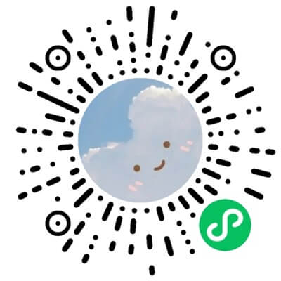
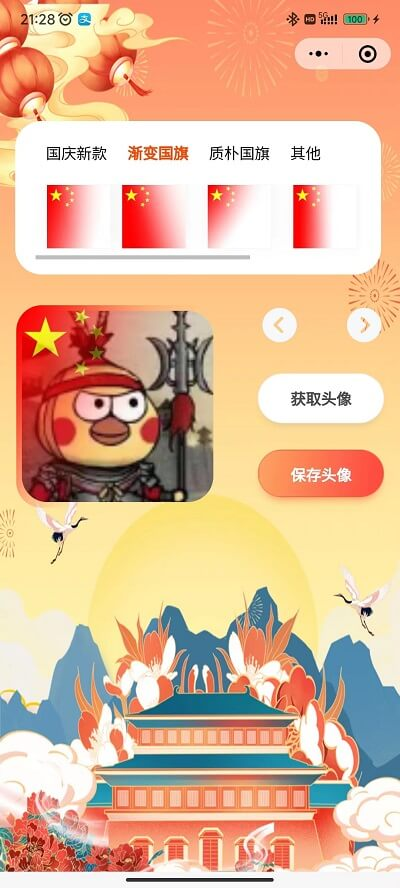
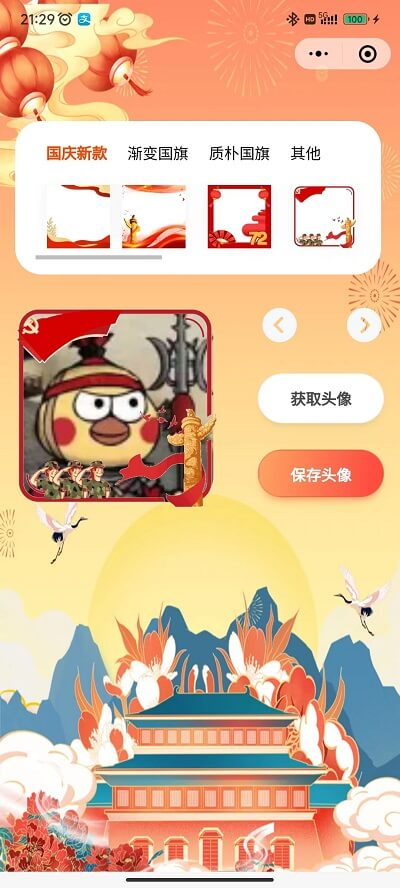

### 介绍
* 火爆全网的国庆头像生成器，用的是uniapp，支持微信小程序和h5
* 微信小程序可以获取微信头像，h5需要上传头像，上传图片用到了裁切组件，保证头像是正方形
* 可以选择国旗或其他背景，支持扩展，自由添加蒙版图片

### 平台
h5，微信小程序

### 邮箱
有问题可以提Issue，或者发邮件：249042680@qq.com，觉得不错可以点个赞

### 常见问题
* 怎么运行不了？
- 需要用HBuilder运行代码，运行到小程序开发工具，换成自己的小程序appid
* 发布微信小程序, 不能正常下载头像？
- 需要到[小程序后台](https://mp.weixin.qq.com/)-开发管理-服务器域名-downloadFile合法域名, 添加https://thirdwx.qlogo.cn

### H5网址
https://static-2503170c-6f74-4217-ac1a-43133fb6d1b4.bspapp.com/guoqing

### 小程序

### 仓库
[gitee](https://gitee.com/kangleyunju/guoqing)

[github](https://github.com/kangleyunju/guoqing)